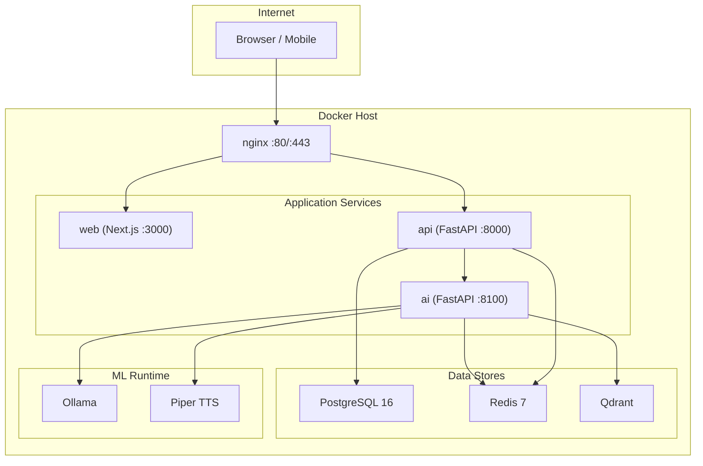

# Replica AI

A self-hosted AI companion that learns, remembers, and evolves with its owner. Built as a full-stack monorepo with local-first LLM inference, voice/video interaction, family access controls, and end-to-end encryption.

## Architecture



**Only nginx is exposed to the internet.** All other services communicate on an internal Docker network.

## Tech Stack

| Layer | Technology |
|-------|-----------|
| Frontend | Next.js 14 (App Router), TypeScript, Tailwind CSS, shadcn/ui |
| Backend API | FastAPI, Python 3.11+, Pydantic v2, SQLAlchemy 2.0 (async) |
| AI Service | FastAPI, Ollama, Qdrant, faster-whisper, Resemblyzer, Piper TTS |
| Database | PostgreSQL 16, PgBouncer (connection pooling) |
| Cache | Redis 7 (AOF persistence) |
| Vector DB | Qdrant |
| LLM Runtime | Ollama (CPU, local models) |
| Monorepo | Turborepo + npm workspaces |
| Infrastructure | Docker Compose, nginx, Let's Encrypt, GitHub Actions CI/CD |

## Features

- **Chat with RAG** &mdash; streaming text chat backed by retrieval-augmented generation from personal knowledge
- **Voice & Video Calls** &mdash; full-duplex voice (STT + TTS) and video calls with face verification
- **Knowledge Pipeline** &mdash; ingest documents, learn from conversations, web browsing, and self-directed research
- **Family Access** &mdash; invite family members with configurable rules, QR codes, legacy mode
- **Personality Learning** &mdash; emotion detection, personality profiling, conversation fine-tuning
- **External LLM Support** &mdash; multi-provider (OpenAI, Anthropic, etc.) with budget tracking and auto-learn
- **Billing** &mdash; Stripe subscription, survival mode with grace period, auto-pay
- **Security** &mdash; 2FA (TOTP), AES-256-GCM encryption at rest, audit logging, per-category rate limiting
- **Multi-Instance Sync** &mdash; run multiple replicas with conflict resolution
- **Web Browsing** &mdash; URL fetch, search, page monitoring with change detection

## Quick Start

### Prerequisites

- Node.js >= 20, npm >= 10
- Python >= 3.11
- Docker & Docker Compose

### Development Setup

```bash
# 1. Clone and install dependencies
git clone <repo-url> replica-ai && cd replica-ai
make install

# 2. Start infrastructure (Postgres, Redis, Qdrant, Ollama)
make docker-up

# 3. Set up environment and run migrations
make env          # copies .env.example files
make db-migrate   # run Prisma migrations
make dev          # start all apps in dev mode
```

The web app runs at `http://localhost:3000`, the API at `http://localhost:8000/docs`.

## Project Structure

```
replica-ai/
├── apps/
│   ├── web/          # Next.js 14 frontend (App Router)
│   ├── api/          # FastAPI backend (auth, DB, orchestration)
│   └── ai/           # AI/ML service (LLM, RAG, embeddings, TTS/STT)
├── packages/
│   ├── shared/       # Shared TypeScript types & constants
│   └── db/           # Prisma schema & client
├── docs/             # Architecture, deployment, protocol docs
├── nginx/            # Production reverse proxy config
├── scripts/          # Build, deploy, backup scripts
├── docker-compose.yml       # Development stack
├── docker-compose.prod.yml  # Production stack
└── Makefile                 # Orchestration commands
```

### Service Responsibilities

| Service | Port | Owns | Depends On |
|---------|------|------|-----------|
| `web` | 3000 | UI, server components, client hydration | `api` |
| `api` | 8000 | Auth, users, owners, conversations, billing, WebSockets | PostgreSQL, Redis, `ai` |
| `ai` | 8100 | LLM inference, RAG, embeddings, knowledge ingestion, TTS/STT | Qdrant, Redis, Ollama, Piper |

## Available Commands

```bash
make dev            # Start infra + all apps in dev mode
make build          # Build everything
make install        # Install all deps (npm + Python venv)
make docker-up      # Start Docker services only
make docker-down    # Stop Docker services
make db-migrate     # Run Prisma migrations
make db-seed        # Seed database
make lint           # Lint all code (TS + Python)
make type-check     # Type check all code
make format         # Format all code
make env            # Copy .env.example files
```

## Documentation

- [Architecture](docs/architecture.md) &mdash; system design and data flow
- [Deployment](docs/deployment.md) &mdash; production setup, secrets, backups, monitoring
- [API Reference](docs/api-reference.md) &mdash; REST + WebSocket API overview
- [API Errors](docs/api-errors.md) &mdash; error codes and handling
- [WebSocket Protocol](docs/websocket-protocol.md) &mdash; real-time messaging format
- [Integration Test Checklist](docs/integration-test-checklist.md) &mdash; manual testing guide
- [Launch Checklist](docs/launch-checklist.md) &mdash; pre-launch security & performance audit
- [Contributing](CONTRIBUTING.md) &mdash; development workflow and standards
- [Changelog](CHANGELOG.md) &mdash; release history

## License

Private / All rights reserved.
